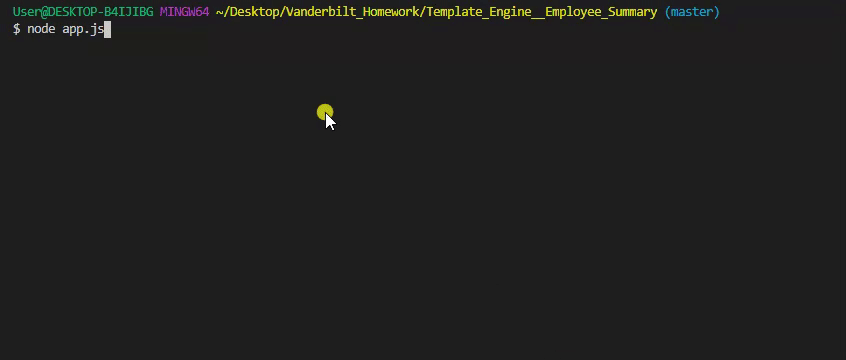
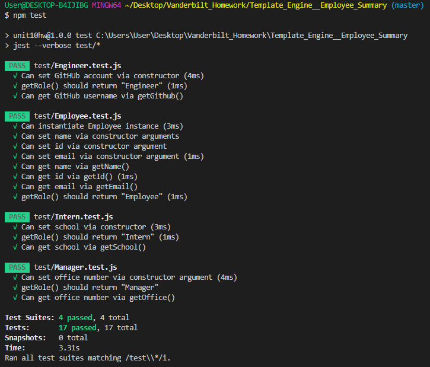
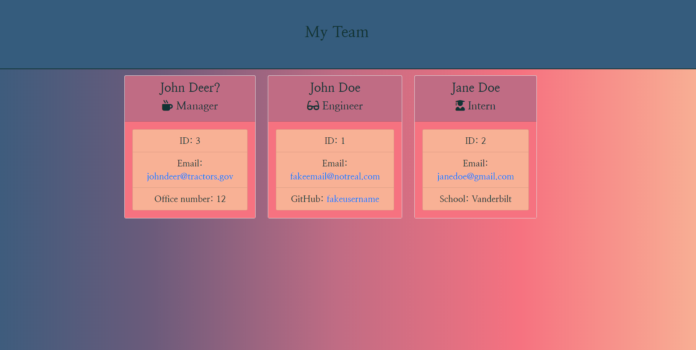

# Template Engine - Employee Summary

## Images

## 

## 

## 

## Application Description

## This application is a command line interface that generates an html page of employees using node.js. The user first runs app.js and is given a series of prompts that ask information about the employee being entered. After this series of prompts is executed the user is asked if they have another employee to enter information for. If the user indicates yes the prompts are run through again, if the user indicates no the html is generated.
